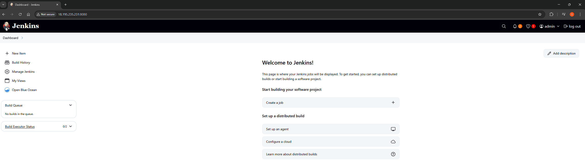
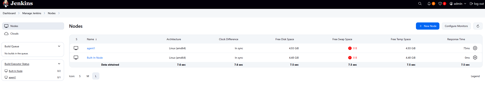
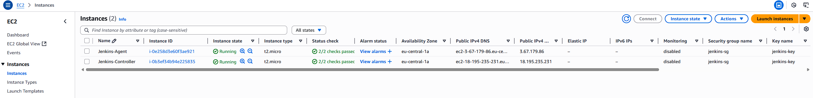
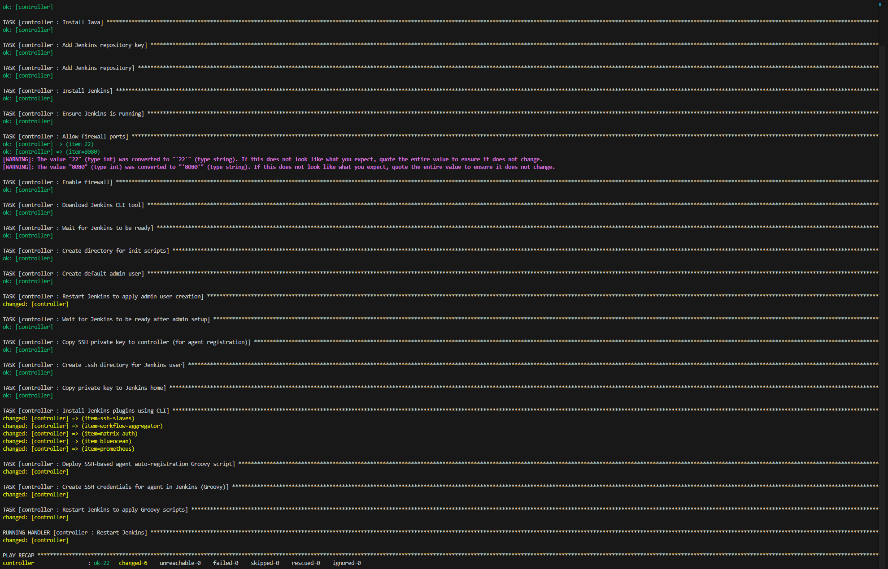
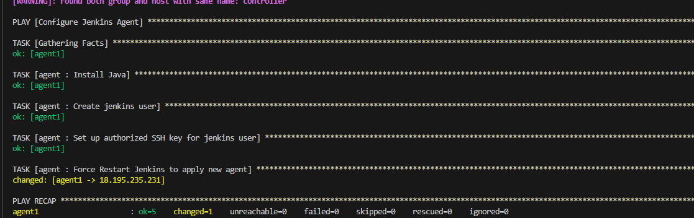
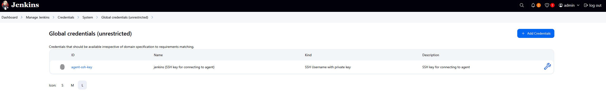

# Provisioning Results

## Jenkins UI

Jenkins is accessible on port `8080` and shows the dashboard screen.

---

## Agent Node Online

📸 The `Manage Jenkins → Nodes` page confirms that the SSH agent `agent1` is online and ready.

---

## EC2 Instances

📸 AWS EC2 dashboard shows both `controller` and `agent` instances running with security groups attached.

---

## Terminal Output

Ansible provisioned Jenkins controller:

Ansible provisioned Jenkins agent:

---

## SSH Credential in Jenkins

📸 Jenkins > Credentials includes an SSH key configured for agent communication and created automatically through the playbook using the groovy init script.

---
